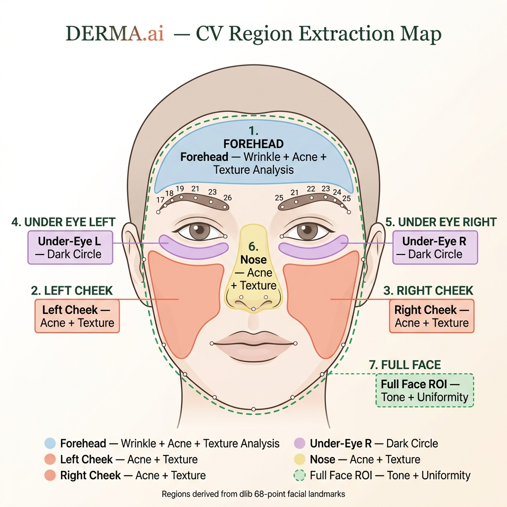

# DERMA.ai — Classical CV Pipeline: Full Technical Reference

> **Zero ML. Zero cloud. Zero stored images.**  
> Every analysis runs on-device using pure OpenCV + NumPy classical computer vision.

---

## Table of Contents

1. [Architecture Overview](#1-architecture-overview)
2. [No Datasets — Why Classical CV](#2-no-datasets--why-classical-cv)
3. [Color Space Theory](#3-color-space-theory)
4. [Stage 1 — Face Detection (`face_detector.py`)](#4-stage-1--face-detection)
5. [Stage 2 — Region Extraction (`region_extractor.py`)](#5-stage-2--region-extraction)
6. [Stage 3A — Acne Detection (`acne_detector.py`)](#6-stage-3a--acne-detection)
7. [Stage 3B — Texture Analysis (`texture_analyzer.py`)](#7-stage-3b--texture-analysis)
8. [Stage 3C — Dark Circle Detection (`dark_circle_detector.py`)](#8-stage-3c--dark-circle-detection)
9. [Stage 3D — Wrinkle Detection (`wrinkle_detector.py`)](#9-stage-3d--wrinkle-detection)
10. [Stage 3E — Skin Tone Analysis (`tone_analyzer.py`)](#10-stage-3e--skin-tone-analysis)
11. [Stage 4 — Scoring & Lifestyle Adjustment (`scorer.py`)](#11-stage-4--scoring--lifestyle-adjustment)
12. [Constants Reference (`config.py`)](#12-constants-reference)
13. [Full Data Flow](#13-full-data-flow)
14. [Output JSON Schema](#14-output-json-schema)

---

## 1. Architecture Overview

```
Base64 Image
     │
     ▼
image_utils.py          decode_base64_image()  →  BGR ndarray
                        resize_for_processing() →  max 1024px
     │
     ▼
face_detector.py        detect_face()           →  bbox (x,y,w,h) + landmarks[68,2]
     │
     ▼
region_extractor.py     extract_regions()       →  dict of 7 BGR crops (ROIs)
     │
     ├──► acne_detector.py        analyze(regions)
     ├──► texture_analyzer.py     analyze(regions)
     ├──► dark_circle_detector.py analyze(regions)
     ├──► wrinkle_detector.py     analyze(regions)
     └──► tone_analyzer.py        analyze(regions)
                │
                ▼
          feature_extractor.py    (orchestrates all 5 analyzers)
                │
                ▼
          scorer.py               compute_scores(features, lifestyle)
                │
                ▼
          recommender.py          build_recommendations(features, scores)
                │
                ▼
          response_builder.py     build_success_response()  →  JSON
```

Each analyzer is completely **independent** — output of one does not feed another.

---

## 2. No Datasets — Why Classical CV

DERMA.ai uses **no ML training data, no neural network weights, no labelled datasets**.

Instead, it exploits well-understood properties of image data and human physiology:

| What we detect | Physical basis exploited |
|---|---|
| Acne | Inflamed tissue increases red-green contrast in LAB A-channel |
| Texture/pores | Rough surfaces generate high-frequency spatial variation (LBP entropy) |
| Dark circles | Under-eye vessels reduce skin luminance measurably vs cheek baseline |
| Wrinkles | Fine creases produce detectable edge density and line continuity |
| Skin tone | Melanin concentration affects Hue channel standard deviation in HSV |

The only "model file" in the project is **`shape_predictor_68_face_landmarks.dat`** — a pre-trained dlib landmark locator (~100 MB). This is used only for **geometry** (where is the nose?), not for any skin-quality decision.

---

## 3. Color Space Theory

The pipeline uses three color spaces, each chosen for a specific property:

### BGR (OpenCV default)
- Raw pixel format from camera and file decoding
- Used only for ROI cropping and display — never for analysis directly

### LAB (CIELAB)
- **L** = Luminance (0=black, 100=white) — perceptually uniform brightness
- **A** = Green ↔ Red axis — inflamed/red tissue has high A values
- **B** = Blue ↔ Yellow axis

In OpenCV, LAB values are stored as `uint8` (0–255), where:
- `A = 128` is neutral (no red, no green)
- `A > 128` = reddish (acne, redness)
- `L` lower than cheek baseline = darker region (dark circles)

**Used by:** `acne_detector.py`, `dark_circle_detector.py`

### HSV (Hue-Saturation-Value)
- **H** = Color angle, 0–179 in OpenCV (maps to 0–360°)
  - Skin hues fall in ~0–20° range (orange-red)
- **S** = Color purity, 0=grey, 255=pure color
- **V** = Brightness, 0=black, 255=white

The Hue channel is ideal for skin tone uniformity because melanin shifts Hue without drastically changing Saturation or Value. Low-V within the skin mask = dark spot.

**Used by:** `tone_analyzer.py`, `dark_circle_detector.py`

### Grayscale
- Single-channel intensity, 0–255
- All edge and texture algorithms operate on grayscale

**Used by:** `texture_analyzer.py`, `wrinkle_detector.py`, `face_detector.py`

---

## 4. Stage 1 — Face Detection

**File:** [`backend/cv_pipeline/face_detector.py`](backend/cv_pipeline/face_detector.py)

### What it does
Locates the largest face in the image and extracts 68 anatomical landmark points.

### Detection strategy (two-stage with fallback)

```
Input BGR image
      │
      ▼
  Convert to Grayscale
      │
      ├──► dlib HOG face detector (primary)
      │         dlib.get_frontal_face_detector()
      │         Uses a Histogram of Oriented Gradients (HOG) + SVM.
      │         More accurate, works well on frontal faces.
      │
      └──► If dlib finds nothing → HaarCascade fallback
                cv2.CascadeClassifier('haarcascade_frontalface_default.xml')
                Sliding window with Haar features + Adaboost classifier.
                Bundled with OpenCV (no download needed).
```

### Landmark extraction
```python
predictor = dlib.shape_predictor("shape_predictor_68_face_landmarks.dat")
shape = predictor(gray_image, dlib_rect)
landmarks = np.array([[shape.part(i).x, shape.part(i).y] for i in range(68)])
# returns shape: (68, 2) dtype int32
```

The predictor returns the (x, y) of each of 68 pre-defined anatomical points on the face. These were trained by dlib on the 300-W facial landmark dataset (external, one-time download).

### Key constants (from `config.py`)

| Constant | Value | Meaning |
|---|---|---|
| `FACE_DETECTION_SCALE` | `1.1` | Haar scale factor per detection window |
| `FACE_DETECTION_NEIGHBORS` | `5` | Minimum neighbour rectangles to confirm a face |
| `MIN_FACE_SIZE` | `(100, 100)` | Reject detections smaller than 100×100 px |

### Return value
```python
bbox      → (x, y, w, h)  # ints, pixel coordinates
landmarks → np.ndarray shape (68, 2)
```

### Error handling
Raises `FaceNotDetectedError` if both dlib and HaarCascade fail. The Flask route catches this and returns HTTP 422.

---

## 5. Stage 2 — Region Extraction

**File:** [`backend/cv_pipeline/region_extractor.py`](backend/cv_pipeline/region_extractor.py)

### What it does
Slices the image into 7 anatomically meaningful crops (ROIs) using landmark coordinates.

### Landmark index map

The 68 landmarks follow the standard iBUG/300-W layout:

```
Jaw outline:       0–16
Left eyebrow:     17–21
Right eyebrow:    22–26
Nose bridge:      27–30
Nose tip:         31–35
Left eye:         36–41
Right eye:        42–47
Outer lips:       48–59
Inner lips:       60–67
```

### How each ROI is computed

| Region | Landmark indices used | Description |
|---|---|---|
| `forehead` | 17–26 (eyebrows) | Band from face top-Y to mean eyebrow Y; horizontally from pt 17 to pt 26 |
| `left_cheek` | 1–4 (jaw-left), 31 (nose-left), 33 (nose-tip Y) | Rectangle left of nose, above jaw |
| `right_cheek` | 12–15 (jaw-right), 35 (nose-right) | Mirror of left cheek |
| `under_eye_left` | 37–41 (left eye lower lid) | Strip 10% of face height below lower lid |
| `under_eye_right` | 43–47 (right eye lower lid) | Same for right eye |
| `nose` | 27–35 (nose bridge to alae) | Bounding box of nose with ±5 px horizontal padding |
| `full_face` | bbox | Entire face bounding box |

### Pre-processing
Every ROI gets a light Gaussian blur (`kernel=(3,3)`) before being returned, to suppress JPEG/sensor noise without destroying skin structure.

```python
def _blur(roi):
    return cv2.GaussianBlur(roi, ROI_BLUR_KERNEL, 0)  # ROI_BLUR_KERNEL = (3,3)
```

### Safe crop
Out-of-bounds coordinates are clamped to image dimensions. A degenerate crop returns a black 10×10 patch so downstream code always gets a valid array:

```python
def _safe_crop(image, x1, y1, x2, y2):
    x1, y1 = max(0, x1), max(0, y1)
    x2, y2 = min(w, x2), min(h, y2)
    if x2 <= x1 or y2 <= y1:
        return np.zeros((10, 10, 3), dtype=np.uint8)
    return image[y1:y2, x1:x2].copy()
```

---

## 6. Stage 3A — Acne Detection

**File:** [`backend/cv_pipeline/acne_detector.py`](backend/cv_pipeline/acne_detector.py)  
**Regions analysed:** `forehead`, `left_cheek`, `right_cheek`, `nose`

### Why LAB A-channel?

Acne lesions are inflamed — meaning more blood flow → more oxyhaemoglobin → visually redder. The LAB A-channel isolates the red-green axis perceptually, making it the most discriminative single channel for detecting redness independent of lighting brightness.

### Step-by-step pipeline

```
BGR ROI
  │
  ▼ cv2.cvtColor(roi, COLOR_BGR2LAB)
LAB image
  │
  ▼ Extract A-channel (index 1)
A-channel uint8 array  (128=neutral, >128=red)
  │
  ▼ cv2.GaussianBlur(kernel=(5,5))
Smoothed A-channel
  │
  ▼ cv2.threshold(THRESH_BINARY + THRESH_OTSU)
Binary mask  — Otsu automatically finds the optimal threshold
  │
  ▼ cv2.Canny(low=50, high=150)
Edge map
  │
  ▼ cv2.findContours(RETR_EXTERNAL, CHAIN_APPROX_SIMPLE)
List of contours
  │
  ▼ Filter by:
    area ∈ [20, 500] px²       → removes noise and large non-blemish areas
    circularity ≥ 0.4          → keeps round/oval shapes (pimples, not wrinkles)
  │
  ▼ Qualified contours → draw filled mask
    redness_sum = sum of A-channel values inside mask
    pixel_count = area of mask
```

### Circularity formula

```
circularity = (4π × area) / perimeter²
```
- Circle = 1.0
- Long thin line ≈ 0.0
- Acne lesions typically score 0.4–0.9

### Output metrics

```python
{
  "count":            int,    # qualified lesion contours found
  "density":          float,  # count / (total_roi_area / 1000) — per 1000 px²
  "redness_score":    float,  # (mean_A - 128) / 127 × 100, clamped 0–100
  "raw_score":        float,  # count×4 + redness×0.5 + density×5
  "severity":         str,    # "none"|"mild"|"moderate"|"severe"
  "affected_regions": list    # which ROIs had at least 1 lesion
}
```

### Severity thresholds (raw_score)
| Range | Severity |
|---|---|
| 0 – 29 | none |
| 30 – 59 | mild |
| 60 – 79 | moderate |
| 80 – 100 | severe |

---

## 7. Stage 3B — Texture Analysis

**File:** [`backend/cv_pipeline/texture_analyzer.py`](backend/cv_pipeline/texture_analyzer.py)  
**Regions analysed:** `forehead`, `left_cheek`, `right_cheek`, `nose`

### Algorithm 1: Local Binary Pattern (LBP)

LBP is a classic texture descriptor. Normally it requires scikit-image, but here it's implemented **from scratch in pure NumPy** using bit-shifting.

#### How LBP works
For each pixel, compare its intensity to its 8 neighbours. Encode the comparison (neighbour ≥ center = 1, else = 0) as an 8-bit integer:

```
Neighbours (clockwise from top-left):
  bit 0: (-1,-1)   bit 1: (-1, 0)   bit 2: (-1, 1)
  bit 7: ( 0,-1)   CENTER           bit 3: ( 0, 1)
  bit 6: ( 1,-1)   bit 5: ( 1, 0)   bit 4: ( 1, 1)
```

Result is a 256-bin histogram of patterns across the ROI.

#### NumPy implementation (no loops)

```python
_LBP_OFFSETS = [(-1,-1),(-1,0),(-1,1),(0,1),(1,1),(1,0),(1,-1),(0,-1)]

def _compute_lbp(gray):
    lbp = np.zeros_like(gray)
    for bit, (dy, dx) in enumerate(_LBP_OFFSETS):
        shifted = np.roll(np.roll(gray, dy, axis=0), dx, axis=1)
        lbp |= ((shifted >= gray).astype(np.uint8) << bit)
    return lbp
```

`np.roll` shifts the entire image in a direction, creating the "neighbour" view. The comparison is vectorised across all pixels simultaneously — no Python loop over pixels.

#### LBP → Roughness score

```python
hist_norm = histogram(lbp_map) / total_pixels
roughness  = std(hist_norm) / mean(hist_norm)  # coefficient of variation
# Higher CoV = more varied texture pattern = rougher skin
```

#### LBP → Uniformity score

```python
entropy     = -sum(hist_norm × log2(hist_norm))
uniformity  = 1 - (entropy / log2(256))
# Uniform texture has low entropy → high uniformity score
```

### Algorithm 2: Laplacian Variance (Pore Visibility)

The Laplacian operator computes the second spatial derivative — it responds strongly to sharp local changes (edges, pores).

```python
lap = cv2.Laplacian(gray, cv2.CV_64F)
pore_visibility = lap.var()
```

High Laplacian variance = many sharp edges = large visible pores or rough texture.

### Normalisation

| Raw metric | Empirical range | Normalisation to 0–100 |
|---|---|---|
| `roughness` (CoV) | ~0–5 | `× 20` |
| `pore_visibility` (Lap variance) | ~0–2000 | `/ 20` |

Final `raw_score = roughness_score × 0.6 + pore_score × 0.4`

---

## 8. Stage 3C — Dark Circle Detection

**File:** [`backend/cv_pipeline/dark_circle_detector.py`](backend/cv_pipeline/dark_circle_detector.py)  
**Regions used:** `under_eye_left`, `under_eye_right`, `left_cheek`, `right_cheek`

### Why compare to cheeks?

Skin tone varies enormously between individuals. A fixed luminance threshold would fail for dark-skinned subjects. Instead, the algorithm uses the **cheek skin as a per-person reference baseline** — dark circles are detected as luminance *relative to that person's own cheek*.

### Algorithm

#### Step 1 — LAB L-channel luminance comparison

```python
# Cheek luminance (baseline reference)
cheek_l = mean(LAB_L_channel(left_cheek), LAB_L_channel(right_cheek))

# Under-eye luminance
ue_l = mean(LAB_L_channel(under_eye_left), LAB_L_channel(under_eye_right))

# Darkness ratio — how much darker is under-eye vs cheek baseline
darkness_ratio = max(0.0, (cheek_l - ue_l) / cheek_l)
```

- `darkness_ratio = 0.0` → same brightness as cheeks (no dark circles)
- `darkness_ratio = 0.2` → 20% darker than cheek baseline (severe)

#### Step 2 — HSV Saturation for pigmentation

```python
ue_s = mean(HSV_S_channel(under_eye_left), HSV_S_channel(under_eye_right))
pigmentation_score = clip(ue_s / 255 × 100, 0, 100)
```

Pigmented (blue/purple) dark circles have higher colour saturation than vascular (red) ones. This score differentiates the two subtypes.

### Severity thresholds (darkness_ratio)

| Threshold | Severity |
|---|---|
| < 0.07 | none |
| 0.07 – 0.14 | mild |
| 0.14 – 0.22 | moderate |
| > 0.22 | severe |

### Raw score formula

```python
raw_score = clip(darkness_ratio × 300 + pigmentation_score × 0.3, 0, 100)
```

---

## 9. Stage 3D — Wrinkle Detection

**File:** [`backend/cv_pipeline/wrinkle_detector.py`](backend/cv_pipeline/wrinkle_detector.py)  
**Region analysed:** `forehead`

### Challenge
Fine lines are low-contrast features that standard Canny edge detection misses. Two steps address this: contrast normalisation (CLAHE) and morphological line-joining.

### Step-by-step pipeline

```
BGR forehead ROI
  │
  ▼ cvtColor → Grayscale
  │
  ▼ GaussianBlur(kernel=(3,3))
    Suppresses sensor noise while keeping major structures
  │
  ▼ CLAHE (Contrast Limited Adaptive Histogram Equalisation)
    clipLimit=2.0, tileGridSize=(4,4)
    Enhances local contrast → makes faint fine lines visible to Canny
  │
  ▼ cv2.Canny(low=30, high=80)
    Narrow thresholds — detect weak edges (fine lines)
    Standard thresholds (50/150) would miss wrinkles
  │
  ▼ cv2.morphologyEx(MORPH_CLOSE, kernel=(3,3))
    Morphological closing fills small gaps:
    wrinkles appear as dashed lines → closing makes them solid
  │
  ▼ Metric 1: Edge Density
    edge_density = count_nonzero(edges) / total_pixels
  │
  ▼ cv2.HoughLinesP(rho=1, theta=π/180, threshold=15,
                    minLineLength=20, maxLineGap=5)
    Probabilistic Hough transform — detects line segments
    Metric 2: line_count = number of detected line segments
```

### Why edge density alone isn't enough

Edge density counts all edge pixels. Noise and pores also produce edges. HoughLinesP filters for **long continuous lines** (≥20 px), which are characteristic of actual wrinkle creases. Combining both prevents noise misclassification.

### Score formula

```python
density_score = clip(mean_density × 1000, 0, 80)
line_score    = clip(line_count   × 2,    0, 20)
raw_score     = density_score + line_score
```

Empirical edge density calibration:
- `0.02` → mild wrinkles start
- `0.05` → moderate
- `0.10` → severe

---

## 10. Stage 3E — Skin Tone Analysis

**File:** [`backend/cv_pipeline/tone_analyzer.py`](backend/cv_pipeline/tone_analyzer.py)  
**Region analysed:** `full_face`

### Step 1 — Skin mask

Isolate only skin-colored pixels (exclude eyes, lips, eyebrows, hair):

```python
lower = np.array([0, 20, 70],   dtype=np.uint8)  # HSV lower bound
upper = np.array([20, 255, 255], dtype=np.uint8)  # HSV upper bound
skin_mask = cv2.inRange(hsv_image, lower, upper)
```

The range `H ∈ [0,20]` captures orange-pink-red skin tones. `S ≥ 20` and `V ≥ 70` exclude grey/dark regions (shadows, hair).

**Fallback:** If the mask captures fewer than 50 pixels (very dark skin or bad lighting), the entire ROI is treated as skin to avoid a false zero result.

### Step 2 — Tone Uniformity

```python
h_skin = H_channel[skin_mask > 0]
h_std  = std(h_skin)
tone_uniformity = clip(1.0 - (h_std / 180.0), 0.0, 1.0)
```

**Interpretation:**
- Low H std → consistent hue across the face → **even tone** → uniformity near 1.0
- High H std → large hue variation → redness/hyperpigmentation patches → uniformity near 0.0

### Step 3 — Redness Index

```python
high_sat_mask = (S_channel > 80) & (skin_mask > 0)
redness_index = mean(S_channel[high_sat_mask]) / 255 × 100
```

Selects only the most saturated skin pixels — redness is characterised by high saturation at low hue angles (the red-orange range already selected by the skin mask).

### Step 4 — Hyperpigmentation Spots

```python
dark_mask = (V_channel < 80) & (skin_mask > 0)
contours  = cv2.findContours(dark_mask, RETR_EXTERNAL, CHAIN_APPROX_SIMPLE)
spots     = count(contours where area >= 30)
```

Dark spots (freckles, age spots, melasma patches, acne scars) appear as low-V (dark) regions within the skin-colored area. Area threshold (≥30 px²) filters out single-pixel noise.

### Overall tone label

| Uniformity | Label |
|---|---|
| > 0.80 | `even` |
| 0.65 – 0.80 | `slightly_uneven` |
| < 0.65 | `uneven` |

### Raw score formula

```python
uniformity_penalty   = (1 - tone_uniformity) × 60    # 0–60 pts
redness_contribution = redness_index × 0.3            # 0–30 pts
hyper_contribution   = min(spots × 5, 40)             # 0–40 pts
raw_score = clip(sum of above, 0, 100)
```

---

## 11. Stage 4 — Scoring & Lifestyle Adjustment

**File:** [`backend/recommendation_engine/scorer.py`](backend/recommendation_engine/scorer.py)

### Input
Five `raw_score` values (0–100) from the five analyzers, plus the lifestyle JSON.

### Lifestyle adjustments

Each adjustment adds penalty points directly to the affected condition score before weighting:

| Condition | Trigger | Penalty |
|---|---|---|
| `dark_circles` | sleep_hours < 6 | +15 pts |
| `acne` | sleep_hours < 6 | +5 pts |
| `acne` | stress_level > 7/10 | +10 pts |
| `texture` | water_glasses < 6 | +10 pts |
| All conditions | diet_quality = "poor" | +5 pts each |

### Weighted overall score

```python
overall_problem_score = (
    acne_score         × 0.35 +
    texture_score      × 0.25 +
    dark_circle_score  × 0.15 +
    wrinkle_score      × 0.15 +
    tone_score         × 0.10
)
skin_health_score = 100 - overall_problem_score
```

Higher `skin_health_score` = healthier skin. This is what the animated ring displays in the UI.

---

## 12. Constants Reference

**File:** [`backend/config.py`](backend/config.py)

### Face Detection

| Constant | Value | Purpose |
|---|---|---|
| `FACE_DETECTION_SCALE` | `1.1` | Haar window scale factor |
| `FACE_DETECTION_NEIGHBORS` | `5` | Minimum rectangle agreements for Haar |
| `MIN_FACE_SIZE` | `(100,100)` | Smallest face accepted |

### Region Extraction

| Constant | Value | Purpose |
|---|---|---|
| `FOREHEAD_HEIGHT_RATIO` | `0.25` | Reserved (landmark method used instead) |
| `ROI_BLUR_KERNEL` | `(3,3)` | Pre-analysis denoising kernel |
| `UNDER_EYE_HEIGHT_RATIO` | `0.10` | Under-eye strip height as fraction of face height |

### Acne Detection

| Constant | Value | Purpose |
|---|---|---|
| `ACNE_BLUR_KERNEL` | `(5,5)` | Smooth A-channel before thresholding |
| `ACNE_CANNY_LOW` | `50` | Canny lower hysteresis threshold |
| `ACNE_CANNY_HIGH` | `150` | Canny upper hysteresis threshold |
| `ACNE_MIN_CONTOUR_AREA` | `20` | Filter out sub-pixel noise |
| `ACNE_MAX_CONTOUR_AREA` | `500` | Filter out large non-lesion regions |
| `ACNE_CIRCULARITY_THRESHOLD` | `0.4` | Minimum roundness to qualify as lesion |

### Texture Analysis

| Constant | Value | Purpose |
|---|---|---|
| `LBP_RADIUS` | `1` | LBP neighbour radius in pixels |
| `LBP_NEIGHBORS` | `8` | Number of LBP comparison points |
| `TEXTURE_LAPLACIAN_KERNEL` | `3` | Laplacian kernel size |

### Wrinkle Detection

| Constant | Value | Purpose |
|---|---|---|
| `WRINKLE_BLUR_KERNEL` | `(3,3)` | Pre-Canny noise suppression |
| `WRINKLE_CANNY_LOW` | `30` | Low threshold — tuned for fine lines |
| `WRINKLE_CANNY_HIGH` | `80` | High threshold |
| `WRINKLE_MORPH_KERNEL` | `(3,3)` | Morphological closing kernel |
| `WRINKLE_HOUGH_MIN_LINE` | `20` | Min px for a line segment (HoughLinesP) |
| `WRINKLE_HOUGH_MAX_GAP` | `5` | Max px gap to connect segments |

### Skin Tone

| Constant | Value | Purpose |
|---|---|---|
| `SKIN_HSV_LOWER` | `(0, 20, 70)` | HSV lower skin mask bound |
| `SKIN_HSV_UPPER` | `(20, 255, 255)` | HSV upper skin mask bound |
| `HYPERPIGMENTATION_V_THRESHOLD` | `80` | V-channel below this = dark spot |
| `HYPERPIGMENTATION_MIN_AREA` | `30` | Min area for a spot contour (px²) |

### Dark Circles

| Constant | Value | Purpose |
|---|---|---|
| `DARK_CIRCLE_SEVERITY_MILD` | `0.07` | Darkness ratio ≥ this = mild |
| `DARK_CIRCLE_SEVERITY_MODERATE` | `0.14` | ≥ this = moderate |
| `DARK_CIRCLE_SEVERITY_SEVERE` | `0.22` | ≥ this = severe |

### Severity Labels (universal)

```python
SEVERITY = {"none": 0, "mild": 30, "moderate": 60, "severe": 80}
# A raw_score >= 80 → "severe"; 60–79 → "moderate"; etc.
```

### Score Weights

```python
SCORE_WEIGHTS = {
    "acne":         0.35,
    "texture":      0.25,
    "dark_circles": 0.15,
    "wrinkles":     0.15,
    "tone":         0.10,
}
```

---

## 13. Full Data Flow

```
Client sends:
  POST /api/analyze
  {
    "image": "data:image/jpeg;base64,/9j/4AAQ...",
    "lifestyle": { "sleep_hours": 6, "stress_level": 8, ... }
  }

app.py:
  1. decode_base64_image(body["image"])    → BGR ndarray  (H×W×3)
  2. resize_for_processing(image, 1024)   → same ndarray, max 1024px
  3. detect_face(image)                   → bbox, landmarks[68,2]
  4. extract_regions(image, bbox, lm)     → {forehead: roi, cheek: roi, ...}
  5. extract_features(image, regions)     → {acne:{...}, texture:{...}, ...}
  6. compute_scores(features, lifestyle)  → {acne_score:22, overall_score:74, ...}
  7. build_recommendations(...)           → list of condition dicts
  8. build_success_response(...)          → final JSON

Total: typically 300ms–2000ms depending on face size and hardware
```

---

## 14. Output JSON Schema

```json
{
  "success": true,
  "face_detected": true,
  "overall_score": 74,

  "condition_scores": {
    "acne": 22,
    "texture": 18,
    "dark_circles": 31,
    "wrinkles": 10,
    "tone": 15
  },

  "condition_details": {
    "acne": {
      "count": 3,
      "density": 0.012,
      "redness_score": 18.5,
      "affected_regions": ["left_cheek"]
    },
    "texture": {
      "roughness_score": 14.2,
      "pore_visibility": 22.1,
      "uniformity": 0.8341
    },
    "dark_circles": {
      "darkness_ratio": 0.082,
      "pigmentation_score": 24.3
    },
    "wrinkles": {
      "edge_density": 0.000812,
      "line_count": 2
    },
    "tone": {
      "tone_uniformity": 0.8712,
      "redness_index": 31.4,
      "hyperpigmentation_spots": 1,
      "overall_tone": "even"
    }
  },

  "lifestyle_impact": {
    "high_stress": "Stress level 8/10 elevates cortisol, worsening acne (+10 pts)."
  },

  "recommendations": [
    {
      "condition": "Acne & Blemishes",
      "condition_key": "acne",
      "severity": "mild",
      "score": 22,
      "causes": ["Excess sebum", "Mild inflammation"],
      "routine_steps": [
        {
          "step": "Cleanser",
          "instruction": "Cleanse morning and night...",
          "product_type": "Salicylic acid 0.5–1% cleanser"
        }
      ],
      "lifestyle_changes": ["Avoid touching your face"],
      "ingredients_to_use": ["Salicylic acid", "Niacinamide"],
      "ingredients_to_avoid": ["Coconut oil", "Heavy silicones"],
      "see_dermatologist": false
    }
  ],

  "see_dermatologist": false,
  "processing_time_ms": 842.3,
  "disclaimer": "Analysis conducted using classical computer vision. This is not a medical diagnosis."
}
```

---

> **All CV processing happens in-process, in memory. No image is written to disk. No data leaves the machine.**

---

## 15. Visual Region Map

The diagram below shows exactly which facial areas the pipeline crops and which analyzers consume each crop.



### Region-to-Analyzer mapping

| # | Region key | Landmark indices | Color in diagram | Analyzers |
|---|---|---|---|---|
| 1 | `forehead` | 17–26 (eyebrows) | 🔵 Light blue | Acne · Texture · **Wrinkle** |
| 2 | `left_cheek` | 1–4, 31, 33 | 🟠 Coral | **Acne** · Texture · Dark circle (ref) |
| 3 | `right_cheek` | 12–15, 35, 33 | 🟠 Coral | **Acne** · Texture · Dark circle (ref) |
| 4 | `under_eye_left` | 37–41 (lower lid) | 🟣 Purple | **Dark Circle** |
| 5 | `under_eye_right` | 43–47 (lower lid) | 🟣 Purple | **Dark Circle** |
| 6 | `nose` | 27–35 (bridge→alae) | 🟡 Yellow | **Acne** · Texture |
| 7 | `full_face` | bbox (x,y,w,h) | 🟢 Dashed green | **Tone** · Uniformity · Hyperpigmentation |

### What each analyzer reads from which region

```
acne_detector.py
  ├── forehead          → LAB A-channel redness + contour detection
  ├── left_cheek        → LAB A-channel redness + contour detection
  ├── right_cheek       → LAB A-channel redness + contour detection
  └── nose              → LAB A-channel redness + contour detection

texture_analyzer.py
  ├── forehead          → LBP histogram + Laplacian variance
  ├── left_cheek        → LBP histogram + Laplacian variance
  ├── right_cheek       → LBP histogram + Laplacian variance
  └── nose              → LBP histogram + Laplacian variance

dark_circle_detector.py
  ├── under_eye_left    → LAB L-channel luminance measurement
  ├── under_eye_right   → LAB L-channel luminance measurement
  ├── left_cheek        → REFERENCE baseline luminance only
  └── right_cheek       → REFERENCE baseline luminance only

wrinkle_detector.py
  └── forehead          → CLAHE → Canny → HoughLinesP

tone_analyzer.py
  └── full_face         → HSV skin mask → H uniformity, S redness, V dark spots
```

> **All CV processing happens in-process, in memory. No image is written to disk. No data leaves the machine.**
